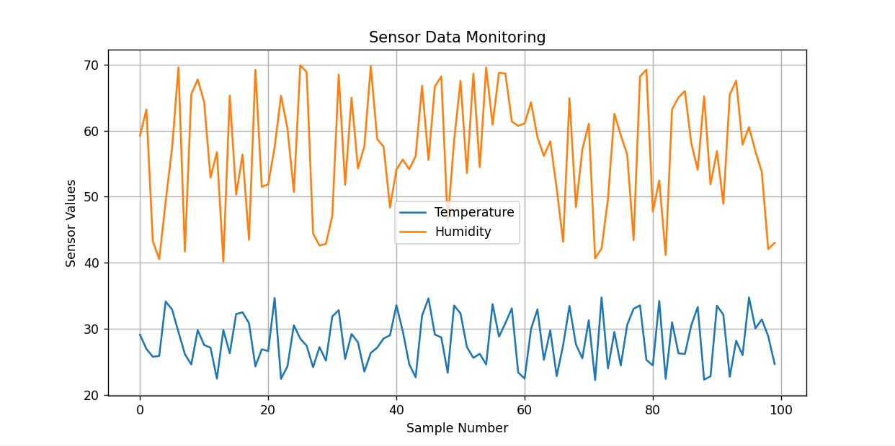

# Sensor Data Monitoring System

> Python Project | Sensor Simulation | Data Visualization | Embedded Systems Support

---

## Overview
This project simulates sensor data and visualizes it using Python. It demonstrates how embedded system sensor outputs can be collected, stored, and analyzed.

This project bridges embedded systems and software by showing how sensor data can be processed and visualized using Python.

---

## Features
- Simulates temperature, humidity, and motion sensor data  
- Stores readings in CSV format  
- Visualizes sensor trends using graphs  
- Summarizes motion detection events  

---

## Tech Stack
- Python  
- pandas  
- matplotlib  
- CSV data handling  

---

##  Project Workflow
1. Generate simulated sensor readings  
2. Save readings into `sensor_data.csv`  
3. Read sensor data using pandas  
4. Visualize temperature and humidity trends  
5. Print motion detection summary  

---

## Sample Output


---

## Results
The system successfully simulates sensor data and visualizes temperature and humidity trends. The output graph demonstrates how sensor values change over time, similar to real embedded monitoring systems.

---

## How to Run

Install dependencies:

```bash
pip install -r requirements.txt
```

Generate sensor data:

```bash
python sensor_simulation.py
```

Visualize data:

```bash
python visualize_sensor_data.py
```

> Note: Run the data generation script first to create the dataset before visualization.
